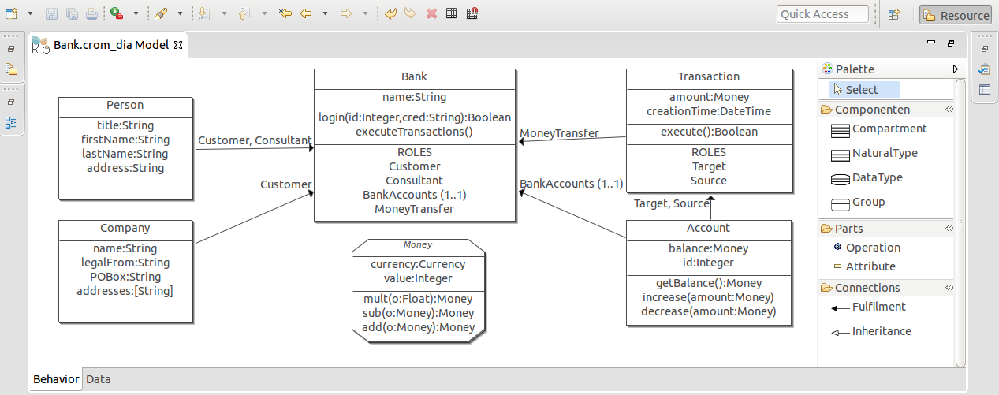
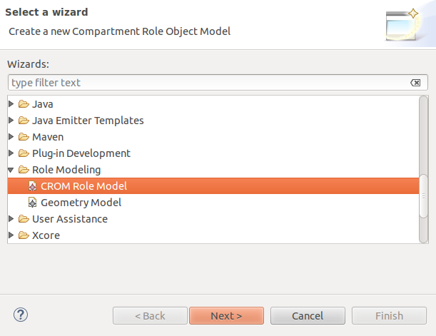
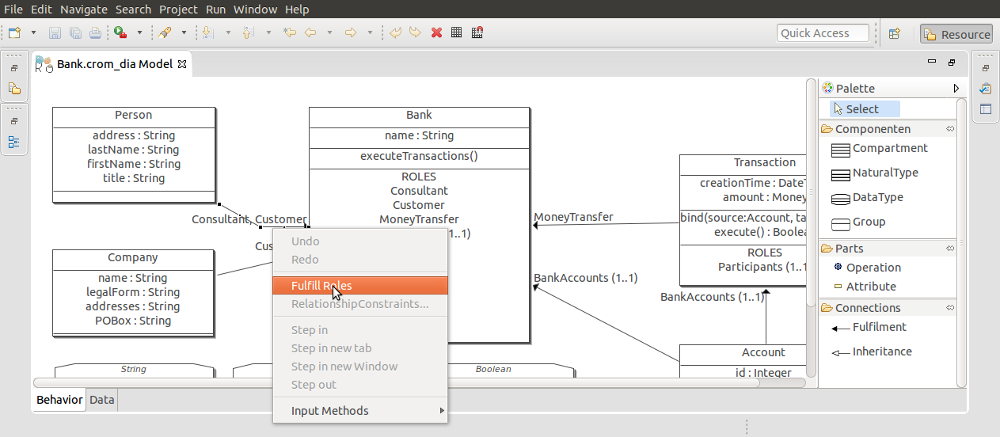
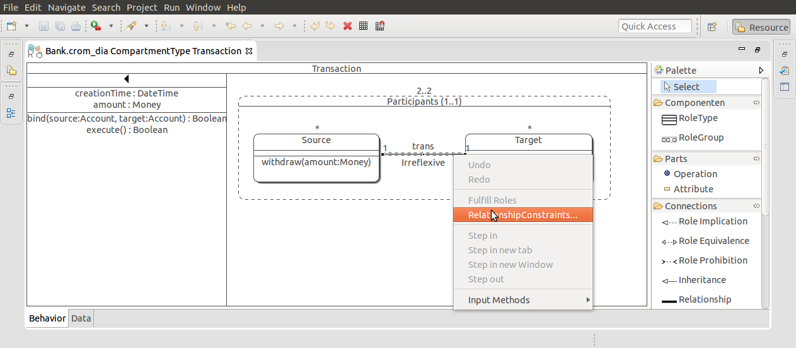
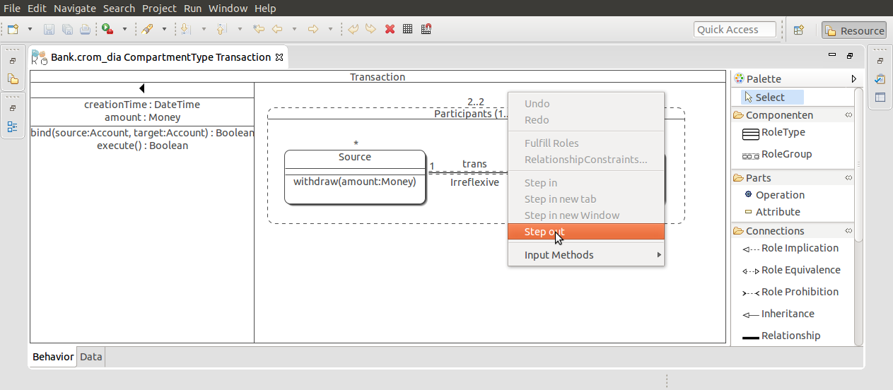

# Full-fledge Role Modeling Editor (FRaMED)
[Thomas Kühn](https://github.com/Eden-06), [Kay Bierzynski](https://github.com/leondart), Sebastian Richly, Uwe Aßmann

This is the artifact submission corresponding to the SLE'16 tool paper with the above title. It features a virtual machine packed with the ready to use modeling editor `FRaMED`. `FRaMED` is a full-fledged role modeling editor allowing the graphical specification of role-based software systems by means of compartments (aka. contexts), objects, roles, and relationships. It is currently maintained and developed as a project on [GitHub](https://github.com/leondart/FRaMED),
however, the artefact corresponds to release [v2.0.3](https://github.com/leondart/FRaMED/releases/tag/v2.0.3).



## Tool Demonstration

Henceforth, we describe and illustrate the installation and usage of `FRaMED`.

### Installation

First and foremost, we have prepared a **virtual machine** for the virtualization environment `VirtualBox`
that can be installed, as follows:

* Download and install `VirtualBox` for your platform from their [website](https://www.virtualbox.org/)
* Download the `FRaMED` virtual machine `framed-ubuntu.ova` from [st.inf.tu-dresden.de/intern/framed/framed-ubuntu.ova](http://st.inf.tu-dresden.de/intern/framed/framed-ubuntu.ova) *(1.8\ GB)*
* Open your `VirtualBox` and *Import* the downloaded file
* Startup the added `framed-ubuntu\_1` virtual machine

Notably, there are alternative methods to install `FRaMED`, such as downloading an [`Eclipse Products`](https://github.com/leondart/FRaMED/releases/tag/v2.0.3) or installation via an [*Update site*](https://github.com/leondart/FRaMED/wiki/Installation-via-Updatesite), however, the virtual machine is the only artifact that is supposed to still work in 10 years from now. Hence, it is the only feasible option for our graphical modeling editor.

### First Steps

After, the virtual machine is launched, double click on the `FRaMED` icon on the desktop to startup FRaMED.
Henceforth, you can explore and use FRaMED to inspect the already opened banking application `Bank.crom_dia`
of the *FramedExample* Project.

To create a new project, select *File > New > Java Project* and create a new project.
Afterwards, you can add a new CROM model by clicking *File > New > Other ...* and selecting *CROM Role Model* within the *Role Modeling* category. As a result, the *Editor UI* opens the newly created empty file. 



### Modeling Role-based Applications

Once you have opened the graphical editor, you start in the top-level view of your application.
It shows the banking example of the top-level view. Here, you can perform the following actions:

* Create natural, data, and compartment types,
* Specify their inheritance relation,
* Create and refine the fills-relation, and
* Step into individual compartment types.




Within a compartment type, the palette changes to reflect the different perspective,
as depicted in Figure below. In detail, the following actions are supported:

* Create role types and role groups,
* Specify various role constraints,
* Create relationship types between two role types,
* Specify inter-relationship constraints,
* Add intra-relationship constraints, and
* Step out of the compartment type






### Code Generation

Last but not least, the code generation can be triggered by right-clicking on a `*.crom` file,
unfolding the *Generate* menu item, and selecting one of the following options:

* Generate the *formal CROM* (`*.py` file), or
* Generate the *SCROLL source code* (`*.scala` file).

The former can be executed with the following shell command:
```bash
python YourExample.py 
```
This will validate the given model assuming that at least `Python` version 2.7.3 is installed and 
the `crom.py` [library](https://github.com/Eden-06/formalCROM) exists in the same folder.
For the latter, we refer the reader to the `SCROLL` documentation available on [GitHub](https://github.com/max-leuthaeuser/SCROLL).

### More Information

You can find more information on `FRaMED` its development and its use in the corresponding [GitHub Wiki](https://github.com/leondart/FRaMED/wiki), as well as the source code via [GitHub](https://github.com/leondart/FRaMED).

